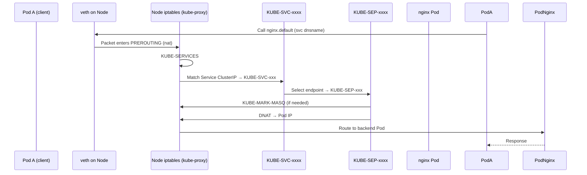

## Intro

kube-proxy에서 아래와 같이 오류가 발생하는 문제가 발생했다.

또한 iptables에 nat 테이블에 KUBE_SERVICES로 전달되는 체인이 사라져서 service 이름으로 호출하는 케이스에 대하여 전부 문제가 발생했다.
```log
E0610 07:32:16.910840       1 proxier.go:1564] "Failed to execute iptables-restore" err=
    exit status 2: Ignoring deprecated --wait-interval option.
    iptables-restore v1.8.8 (legacy): Couldn't load target `KUBE-SVC-UOLAULR5MHUYULMB':No such file or directory
    Error occurred at line: 177
    Try `iptables-restore -h' or 'iptables-restore --help' for more information.
 > ipFamily="IPv4"
```

kube-proxy 자신이 만들어준 chain일텐데 recocile이 발생하지 않은걸까..? KUBE-SVC를 매뉴얼하게 수정한건가..? 의심이 들었다

## Deep dive

Pod A가 nginx.default 서비스를 직접 호출한다고 생각해보자. (DNS 스킵)
보통 iptables를 사용하는 kube-proxy의 경우 iptables nat 테이블에 다음 순서로 패킷이 전달된다.



아래 명령어로 실제 nat 테이블에 적용된 규칙들을 확인할 수 있다.
```sh
iptables -t nat -nvL
```

이 떄 kube-proxy는 추기적으로 iptables 규칙을 sync를 한다, kube-proxy 코드를 보면 다음과 같이 메모리에 sync 정보를 iptables 규칙을 저장하고 주기마다 restore하는 것을 볼 수 있다.

```go
	proxier.logger.V(9).Info("Restoring iptables", "rules", proxier.iptablesData.Bytes())

	// NOTE: NoFlushTables is used so we don't flush non-kubernetes chains in the table
	err := proxier.iptables.RestoreAll(proxier.iptablesData.Bytes(), utiliptables.NoFlushTables, utiliptables.RestoreCounters)
```
```go
type Proxier struct {
...
	// The following buffers are used to reuse memory and avoid allocations
	// that are significantly impacting performance.
	iptablesData             *bytes.Buffer
	existingFilterChainsData *bytes.Buffer
	filterChains             proxyutil.LineBuffer
	filterRules              proxyutil.LineBuffer
	natChains                proxyutil.LineBuffer
	natRules                 proxyutil.LineBuffer

```
따라서 모종의 이유로 iptables 체인이 삭제되었고 이로인해 kube-proxy가 자체적으로 restore하지 못하고 있는것으로 확인했다.

원인은 정말 어이없게도 calico 설치시 문제였다. 공식 문서에서도 해당 설정에 대해 잘설명해주고 있었다. calico 설치시, ebpf 모드를 enable하면 kube-proxy가 생성한 iptables 체인을 삭제하는 것이다.
##### `bpfKubeProxyIptablesCleanupEnabled`

| Attribute   | Value                                                                                                                                                              |
| ----------- | ------------------------------------------------------------------------------------------------------------------------------------------------------------------ |
| Key         | `bpfKubeProxyIptablesCleanupEnabled`                                                                                                                               |
| Description | If enabled in BPF mode, Felix will proactively clean up the upstream Kubernetes kube-proxy's iptables chains. Should only be enabled if kube-proxy is not running. |
| Schema      | Boolean.                                                                                                                                                           |
| Default     | `true`                                                                                                                                                             |

공식 문서[1]에서도 kube-proxy가 계속해서 생성되어있고, `BPFKubeProxyIptablesCleanupEnabled`를 따로 설정해주지 않으면, calico-node와 kube-proxy가 계속하여 iptables를 삭제/생성을 주고받는.. 상황이 발생한다.

>If both `kube-proxy` and `BPFKubeProxyIptablesCleanupEnabled` is enabled then `kube-proxy` will write its iptables rules and Felix will try to clean them up resulting in iptables flapping between the two.

실제 calico에서 삭제하는 패턴을 찾아보니 다음과 같았다.[2]  [3]
```go
# int_dataplane.go
	if config.BPFEnabled && config.BPFKubeProxyIptablesCleanupEnabled {
		// If BPF-mode is enabled, clean up kube-proxy's rules too.
		log.Info("BPF enabled, configuring iptables/nftables layer to clean up kube-proxy's rules.")
		iptablesOptions.ExtraCleanupRegexPattern = rules.KubeProxyInsertRuleRegex
		iptablesOptions.HistoricChainPrefixes = append(iptablesOptions.HistoricChainPrefixes, rules.KubeProxyChainPrefixes...)
	}
	
	
# rule_defs.go
	// HistoricNATRuleInsertRegex is a regex pattern to match to match
	// special-case rules inserted by old versions of felix.  Specifically,
	// Python felix used to insert a masquerade rule directly into the
	// POSTROUTING chain.
	//
	// Note: this regex depends on the output format of iptables-save so,
	// where possible, it's best to match only on part of the rule that
	// we're sure can't change (such as the ipset name in the masquerade
	// rule).
	HistoricInsertedNATRuleRegex = `-A POSTROUTING .* felix-masq-ipam-pools .*|` +
		`-A POSTROUTING -o tunl0 -m addrtype ! --src-type LOCAL --limit-iface-out -m addrtype --src-type LOCAL -j MASQUERADE`

	KubeProxyInsertRuleRegex = `-j KUBE-[a-zA-Z0-9-]*SERVICES|-j KUBE-FORWARD`
...
	// Rule previxes used by kube-proxy.  Note: we exclude the so-called utility chains KUBE-MARK-MASQ and co because
	// they are jointly owned by kube-proxy and kubelet.
	KubeProxyChainPrefixes = []string{
		"KUBE-FORWARD",
		"KUBE-SERVICES",
		"KUBE-EXTERNAL-SERVICES",
		"KUBE-NODEPORTS",
		"KUBE-SVC-",
		"KUBE-SEP-",
		"KUBE-FW-",
		"KUBE-XLB-",
	}

```


무슨 특별한 이유가있나해서 조금 더 찾아봤는데, 주석에 Felix 1.4. 버전에서 calico가 생성한 룰이 아닌경우 이상한 rule을 만드는 문제가 있었고 이로인해 non-calico에 의해 생성된 룰을 전부 삭제해주는 것으로 확인했다.

>(6) Improved handling of rule inserts vs Felix 1.4.x.  Previous versions of Felix sometimes
inserted special-case rules that were not marked as Calico rules in any sensible way making
cleanup of those rules after an upgrade difficult.
>
>To make it easier to manage rule insertions (goal 6), we add rule IDs to those too.  With
rule IDs in place, we can easily distinguish Calico rules from non-Calico rules without needing
to know exactly which rules to expect.  To deal with cleanup after upgrade from older versions
that did not write rule IDs, we support special-case regexes to detect our old rules.


따라서 역시나 calico 뿐만 아니라 서드파티를 설치할때에는 문서를 꼭 찬찬히 읽어봐야겠다.

## 참고자료

[1] https://docs.tigera.io/calico/latest/operations/ebpf/enabling-ebpf#avoiding-conflicts-with-kube-proxy

[2] https://github.com/projectcalico/calico/blob/2a6e6053246242887f1219609a7532b6135787f4/felix/dataplane/linux/int_dataplane.go#L512-L517

[3] https://github.com/projectcalico/calico/blob/2a6e6053246242887f1219609a7532b6135787f4/felix/rules/rule_defs.go#L133C1-L146C1